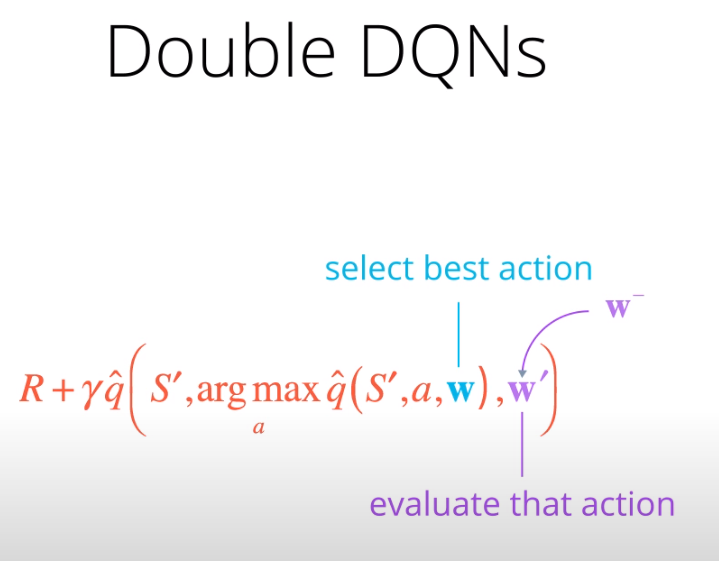

# Project 1: Navigation

### Introduction

The learning algorithm used is vanilla Deep Q Learning as described in
[original paper](https://storage.googleapis.com/deepmind-media/dqn/DQNNaturePaper.pdf).
Instead of an image, a state vector is used an an input to the Deep Neural Network for this project.
In the paper, the input provided to the agent are raw pixels, thus requiring the use of a convolutional network.

The Deep Neural Network architecture in `model.py`:
* Fully connected layer - input: 37 (state size); output: 64
* Fully connected layer - input: 64; output 64
* Fully connected layer - input: 64; output: (action size)

Training parameters used in `Navigation.ipynb`:
* Maximum steps per episode: 1200
* Starting epsilion: 1.0
* Ending epsilion: 0.01
* Epsilion decay rate: 0.995

Parameters used in `dqn_agent.py`:
```
BUFFER_SIZE = int(1e5)  # replay buffer size
BATCH_SIZE = 64         # minibatch size
GAMMA = 0.99            # discount factor
TAU = 1e-3              # for soft update of target parameters
LR = 5e-4               # learning rate
UPDATE_EVERY = 4        # how often to update the network
```
The hyperparameters in the neural network architecture (model.py), agent (dqn_agent) and training (Navigation.ipynb) have not been optimised due to the lack of time and resources.
## Algortihm Description of DQN with Experience Replay and Fixed Q-Target


## Results

The DQN agent successfully solved the environment after 664 episodes in 13 minutes 28 seconds.
This is made possible as the agent started its training from a checkpoint that saved the progress of a previous training session.


### Ideas for future work

1. Learning from pixels
2. Hyperparameter optimisation
3. [Double DQN](https://arxiv.org/abs/1509.06461)

   

   

   DQN tends to overestimate Q-values, particularly at the start of training,
   where some states have high Q-values by chance. Double DQN technique to deal with the overestimation problem
   is to use different set of weights to select the best action and another set of weights to evaluate it.
   The second set of weights may be obtained with from DQNs with Fixed Q-targets. These are weights that are not updated during the learning step.

4. [Prioritized Experience Replay](https://arxiv.org/abs/1511.05952)

   
   Deep Q-Learning samples experience transitions uniformly from a replay memory.
   Prioritized experienced replay assumes that the agent can learn more effectively
   from some transitions than from others, particularly when the TD error is large and if frequency of the transition is low.
   The more important and less frequent transitions are sampled with higher probability from the replay buffer.


5. [Dueling DQN](https://arxiv.org/abs/1511.06581)

   
   The Dueling DQN idea introduces 2 branches of fully connected layers at the end of the network to estimate Q-values.
   One branch will estimate the state values V(s) while the other branch estimates the advantage values, A(s,a).
   are the sum of V(s) and A(s,a).
   2 branches are introduced due to the idea that the state values V(s) tend to be similar across actions.
   However, the advantage values are needed to estimate the Q-values based on the different actions taken

6. [Learning from multi-step bootstrap targets (as in A3C)](https://arxiv.org/abs/1602.01783)
7. [Distributional DQN](https://arxiv.org/abs/1707.06887)
8. [Noisy DQN](https://arxiv.org/abs/1706.10295)
9. [RAINBOW](https://arxiv.org/abs/1710.02298)