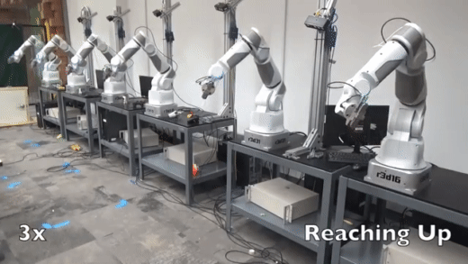
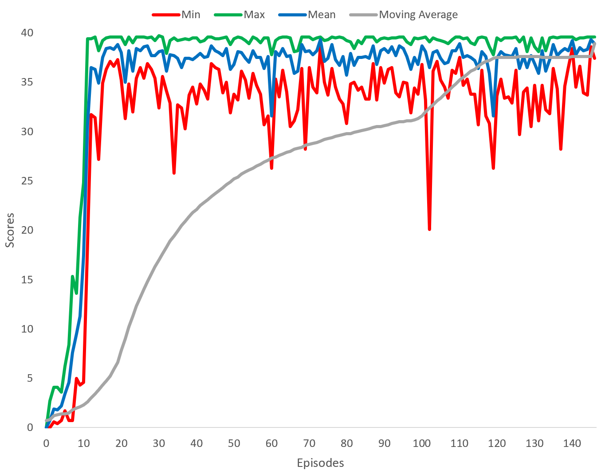

# Project 2: Continuous Control

### Background: Deep Reinforcement Learning for Robotic Arm Manipulation



GIF is derived from Youtube video by [Ethan Holly](https://www.youtube.com/watch?v=ZhsEKTo7V04)


This [paper](https://arxiv.org/pdf/1610.00633.pdf) shows how the use of
multiple agents improve the training performance of algorithms in terms of success rate and
training times. As such, this motivates the solving of version 2 of the Unity Reacher environment.

## Goal
In this project, a reinforcement learning (RL) agent controls
 a robotic arm within Unity's [Reacher](https://github.com/Unity-Technologies/ml-agents/blob/master/docs/Learning-Environment-Examples.md#reacher)
 environment. The goal is for 20 different robotic arms to maintain contact
 with the green spheres.

A reward of +0.1 is provided for each timestep that the agent's hand is in contact with the spheres.
In order to solve the environment, the agent must achieve a score of +30 averaged across all 20 agents
for 100 consecutive episodes.

![Trained Agent][image1]

## Summary of Environment
```python
INFO:unityagents:
'Academy' started successfully!
Unity Academy name: Academy
        Number of Brains: 1
        Number of External Brains : 1
        Lesson number : 0
        Reset Parameters :
		goal_speed -> 1.0
		goal_size -> 5.0
Unity brain name: ReacherBrain
        Number of Visual Observations (per agent): 0
        Vector Observation space type: continuous
        Vector Observation space size (per agent): 33
        Number of stacked Vector Observation: 1
        Vector Action space type: continuous
        Vector Action space size (per agent): 4
        Vector Action descriptions: , , ,

Number of agents: 20
Size of each action: 4
There are 20 agents. Each observes a state with length: 33
The state for the first agent looks like: [ 0.00000000e+00 -4.00000000e+00  0.00000000e+00  1.00000000e+00
 -0.00000000e+00 -0.00000000e+00 -4.37113883e-08  0.00000000e+00
  0.00000000e+00  0.00000000e+00  0.00000000e+00  0.00000000e+00
  0.00000000e+00  0.00000000e+00 -1.00000000e+01  0.00000000e+00
  1.00000000e+00 -0.00000000e+00 -0.00000000e+00 -4.37113883e-08
  0.00000000e+00  0.00000000e+00  0.00000000e+00  0.00000000e+00
  0.00000000e+00  0.00000000e+00  5.75471878e+00 -1.00000000e+00
  5.55726624e+00  0.00000000e+00  1.00000000e+00  0.00000000e+00
 -1.68164849e-01]

```
- In this environment, a double-jointed arm can move to target locations.
- A reward of +0.1 is provided for each step that the agent's hand is in the goal location.
- The observation space consists of 33 variables corresponding to position, rotation, velocity, and angular velocities
of the arm.
- Each action is a vector with four numbers, corresponding to torque applicable to two joints.
- Every entry in the action vector must be a number between -1 and 1.

# Random Agent as a Benchmark
```python
env_info = env.reset(train_mode=False)[brain_name]     # reset the environment
states = env_info.vector_observations                  # get the current state (for each agent)
scores = np.zeros(num_agents)                          # initialize the score (for each agent)
while True:
    actions = np.random.randn(num_agents, action_size) # select an action (for each agent)
    actions = np.clip(actions, -1, 1)                  # all actions between -1 and 1
    env_info = env.step(actions)[brain_name]           # send all actions to tne environment
    next_states = env_info.vector_observations         # get next state (for each agent)
    rewards = env_info.rewards                         # get reward (for each agent)
    dones = env_info.local_done                        # see if episode finished
    scores += env_info.rewards                         # update the score (for each agent)
    states = next_states                               # roll over states to next time step
    if np.any(dones):                                  # exit loop if episode finished
        break
print('Total score (averaged over agents) this episode: {}'.format(np.mean(scores)))
```


## Algorithm Description of DDPG

Two differences in the Reacher environment compared to the previous 'Navigation' project:

1. Multiple agents — Version 2 of Reacher has 20 agents whereas the Navigation project contains a single agent.
2. Continuous action space — The action space is now continuous, compared to 4 discrete actions (left, right, forward, backward) in the Navigation project.

The value-based method in the previous project is not suitable due to the continuous action space.
To tackle this problem, we investigate policy-based method algorithms which have the following advantages:

1. Continuous action spaces compatible
2. Stochastic policies — Policy-based methods can learn true stochastic policies.
3. Simplicity — Policy-based methods directly learn the optimal policy, without a separate value function estimate.
With value-based methods, the agent creates a Q-table as an estimate of the optimal action-value function, from which an optimal policy is derived.
Discretisation (Tile Coding) of the continuous action space may prove infeasible since it be computationally expensive due to the large storage space for the Q-table.


Deep Deterministic Policy Gradient (DDPG) was introduced in Deepmind's reseachers as "a model-free, off-policy actor-critic algorithm
using deep function approximators that can learn policies in high-dimensional, continuous action spaces."
in this [paper](https://arxiv.org/pdf/1509.02971.pdf).  It may also be though t of as a DQN method for continuous action spaces.


#### Actor Critic
Actor-critic methods combines policy-based and value-based methods to accelerate learning.

- Using the policy-based approach, the actor learns how to act by directly
estimating the optimal policy and maximizing reward through gradient ascent.
- Through the value-based approach, the critic estimates the value of future rewards of state-action pairs.

Udacity's single-agent DDPG [code](https://github.com/udacity/deep-reinforcement-learning/blob/master/ddpg-pendulum/ddpg_agent.py)
was used as starting point for this project.

#### Hyperparameters of DDPG agent
```python
BUFFER_SIZE = int(1e5)  # replay buffer size
BATCH_SIZE = 128        # minibatch size
GAMMA = 0.99            # discount factor
TAU = 1e-3              # for soft update of target parameters
LR_ACTOR = 1e-3         # learning rate of the actor
LR_CRITIC = 1e-3        # learning rate of the critic
WEIGHT_DECAY = 0.000001 # L2 weight decay
```
The hyperparameters in the neural network architecture (model.py), agent (ddpg_agent) and training (Navigation.ipynb) have not been optimised due to the lack of time and resources.

#### DDPG agent code
```python
class Agent():
    """Interacts with and learns from the environment."""

    def __init__(self, state_size, action_size, random_seed):
        """Initialize an Agent object.

        Params
        ======
            state_size (int): dimension of each state
            action_size (int): dimension of each action
            random_seed (int): random seed
        """
        self.state_size = state_size
        self.action_size = action_size
        self.seed = random.seed(random_seed)

        # Actor Network (w/ Target Network)
        self.actor_local = Actor(state_size, action_size, random_seed).to(device)
        self.actor_target = Actor(state_size, action_size, random_seed).to(device)
        self.actor_optimizer = optim.Adam(self.actor_local.parameters(), lr=LR_ACTOR)

        # Critic Network (w/ Target Network)
        self.critic_local = Critic(state_size, action_size, random_seed).to(device)
        self.critic_target = Critic(state_size, action_size, random_seed).to(device)
        self.critic_optimizer = optim.Adam(self.critic_local.parameters(), lr=LR_CRITIC, weight_decay=WEIGHT_DECAY)

        # Noise process
        self.noise = OUNoise(action_size, random_seed)

        # Replay memory
        self.memory = ReplayBuffer(action_size, BUFFER_SIZE, BATCH_SIZE, random_seed)

    def step(self, state, action, reward, next_state, done):
        """Save experience in replay memory, and use random sample from buffer to learn."""
        # Save experience / reward
        self.memory.add(state, action, reward, next_state, done)

        # Learn, if enough samples are available in memory
        if len(self.memory) > BATCH_SIZE:
            experiences = self.memory.sample()
            self.learn(experiences, GAMMA)

    def act(self, state, add_noise=True):
        """Returns actions for given state as per current policy."""
        state = torch.from_numpy(state).float().to(device)

        self.actor_local.eval()
        with torch.no_grad():
            action = self.actor_local(state).cpu().data.numpy()
        self.actor_local.train()
        if add_noise:
            action += self.noise.sample()
        return np.clip(action, -1, 1)

    def reset(self):
        self.noise.reset()

    def learn(self, experiences, gamma):
        """Update policy and value parameters using given batch of experience tuples.
        Q_targets = r + γ * critic_target(next_state, actor_target(next_state))
        where:
            actor_target(state) -> action
            critic_target(state, action) -> Q-value

        Params
        ======
            experiences (Tuple[torch.Tensor]): tuple of (s, a, r, s', done) tuples
            gamma (float): discount factor
        """
        states, actions, rewards, next_states, dones = experiences

        # ---------------------------- update critic ---------------------------- #
        # Get predicted next-state actions and Q values from target models
        actions_next = self.actor_target(next_states)
        Q_targets_next = self.critic_target(next_states, actions_next)
        # Compute Q targets for current states (y_i)
        Q_targets = rewards + (gamma * Q_targets_next * (1 - dones))
        # Compute critic loss
        Q_expected = self.critic_local(states, actions)
        critic_loss = F.mse_loss(Q_expected, Q_targets)
        # Minimize the loss
        self.critic_optimizer.zero_grad()
        critic_loss.backward()
        self.critic_optimizer.step()

        # ---------------------------- update actor ---------------------------- #
        # Compute actor loss
        actions_pred = self.actor_local(states)
        actor_loss = -self.critic_local(states, actions_pred).mean()
        # Minimize the loss
        self.actor_optimizer.zero_grad()
        actor_loss.backward()
        self.actor_optimizer.step()

        # ----------------------- update target networks ----------------------- #
        self.soft_update(self.critic_local, self.critic_target, TAU)
        self.soft_update(self.actor_local, self.actor_target, TAU)

```
#### Soft Updates
The target network weights are gradually updated by blending the local network weights with proportion tau (0.1%).
This ensures that the weights of the network only changes slightly during each updates, aiding the stability of learning.


```python
    def soft_update(self, local_model, target_model, tau):
        """Soft update model parameters.
        θ_target = τ*θ_local + (1 - τ)*θ_target

        Params
        ======
            local_model: PyTorch model (weights will be copied from)
            target_model: PyTorch model (weights will be copied to)
            tau (float): interpolation parameter
        """
        for target_param, local_param in zip(target_model.parameters(), local_model.parameters()):
            target_param.data.copy_(tau*local_param.data + (1.0-tau)*target_param.data)
```

#### Ornstein-Uhlenbeck Noise
The Ornstein-Uhlenbeck noise (random noise) is added to the state of the network to aid exploration and enhance the robustness of the RL agent.


```python
class OUNoise:
    """Ornstein-Uhlenbeck process."""

    def __init__(self, size, seed, mu=0., theta=0.15, sigma=0.1):
        """Initialize parameters and noise process.
        mu (the long-running mean) = 0
        theta (velocity of mean reversion) = 0.15
        sigma (volatility) = 0.1
        """
        self.mu = mu * np.ones(size) # long-running mean
        self.theta = theta
        self.sigma = sigma
        self.seed = random.seed(seed)
        self.reset()

    def reset(self):
        """Reset the internal state (= noise) to mean (mu)."""
        self.state = copy.copy(self.mu)

    def sample(self):
        """Update internal state and return it as a noise sample."""
        x = self.state
        dx = self.theta * (self.mu - x) + self.sigma * np.array([np.random.randn() for i in range(len(x))])
        self.state = x + dx
        return self.state
```

#### Replay buffer
The replay buffer contains a collection of experience tuples (S, A, R', S').
The tuples are added to the buffer as the agents interact with the environment.
Experience replay is the (random) sampling of a batch of tuples from the replay buffer for learning.
This helps to break harmful correlations between next states and action taken
while allowing the agent to learn from each tuple multiple times and recall rare occurrences.
This technique was also used to enhance the DQN in the previous project.
```python
class ReplayBuffer:
    """Fixed-size buffer to store experience tuples."""

    def __init__(self, action_size, buffer_size, batch_size, seed):
        """Initialize a ReplayBuffer object.
        Params
        ======
            buffer_size (int): maximum size of buffer
            batch_size (int): size of each training batch
        """
        self.action_size = action_size
        self.memory = deque(maxlen=buffer_size)  # internal memory (deque)
        self.batch_size = batch_size
        self.experience = namedtuple("Experience", field_names=["state", "action", "reward", "next_state", "done"])
        self.seed = random.seed(seed)

    def add(self, state, action, reward, next_state, done):
        """Add a new experience to memory."""
        e = self.experience(state, action, reward, next_state, done)
        self.memory.append(e)

    def sample(self):
        """Randomly sample a batch of experiences from memory."""
        experiences = random.sample(self.memory, k=self.batch_size)

        states = torch.from_numpy(np.vstack([e.state for e in experiences if e is not None])).float().to(device)
        actions = torch.from_numpy(np.vstack([e.action for e in experiences if e is not None])).float().to(device)
        rewards = torch.from_numpy(np.vstack([e.reward for e in experiences if e is not None])).float().to(device)
        next_states = torch.from_numpy(np.vstack([e.next_state for e in experiences if e is not None])).float().to(device)
        dones = torch.from_numpy(np.vstack([e.done for e in experiences if e is not None]).astype(np.uint8)).float().to(device)

        return (states, actions, rewards, next_states, dones)

    def __len__(self):
        """Return the current size of internal memory."""
        return len(self.memory)
```
####Actor Critic Architecture

```python
def hidden_init(layer):
    fan_in = layer.weight.data.size()[0]
    lim = 1. / np.sqrt(fan_in)
    return (-lim, lim)

class Actor(nn.Module):
    """Actor (Policy) Model."""

    def __init__(self, state_size, action_size, seed, fc1_units=128, fc2_units=128):
        """Initialize parameters and build model.
        Params
        ======
            state_size (int): Dimension of each state
            action_size (int): Dimension of each action
            seed (int): Random seed
            fc1_units (int): Number of nodes in first hidden layer
            fc2_units (int): Number of nodes in second hidden layer
        """
        super(Actor, self).__init__()
        self.seed = torch.manual_seed(seed)
        self.fc1 = nn.Linear(state_size, fc1_units)
        self.fc2 = nn.Linear(fc1_units, fc2_units)
        self.fc3 = nn.Linear(fc2_units, action_size)

        # Normalization layers
        self.bn1 = nn.BatchNorm1d(fc1_units)


        self.reset_parameters()

    def reset_parameters(self):
        self.fc1.weight.data.uniform_(*hidden_init(self.fc1))
        self.fc2.weight.data.uniform_(*hidden_init(self.fc2))
        self.fc3.weight.data.uniform_(-3e-3, 3e-3)

    def forward(self, state):
        """Build an actor (policy) network that maps states -> actions."""
        # Reshape the state to comply with Batch Normalization
        if state.dim() == 1:
            state = torch.unsqueeze(state,0)

        x = F.relu(self.fc1(state))
        x = self.bn1(x)
        x = F.relu(self.fc2(x))
        return F.tanh(self.fc3(x))


class Critic(nn.Module):
    """Critic (Value) Model."""

    def __init__(self, state_size, action_size, seed, fcs1_units=128, fc2_units=128):
        """Initialize parameters and build model.
        Params
        ======
            state_size (int): Dimension of each state
            action_size (int): Dimension of each action
            seed (int): Random seed
            fcs1_units (int): Number of nodes in the first hidden layer
            fc2_units (int): Number of nodes in the second hidden layer
        """
        super(Critic, self).__init__()
        self.seed = torch.manual_seed(seed)
        self.fcs1 = nn.Linear(state_size, fcs1_units)
        self.fc2 = nn.Linear(fcs1_units+action_size, fc2_units)
        self.fc3 = nn.Linear(fc2_units, 1)

        # Normalization layer
        self.bn1 = nn.BatchNorm1d(fcs1_units)

        self.reset_parameters()

    def reset_parameters(self):
        self.fcs1.weight.data.uniform_(*hidden_init(self.fcs1))
        self.fc2.weight.data.uniform_(*hidden_init(self.fc2))
        self.fc3.weight.data.uniform_(-3e-3, 3e-3)

    def forward(self, state, action):
        """Build a critic (value) network that maps (state, action) pairs -> Q-values."""
        # Reshape the state to comply with Batch Normalization
        if state.dim() == 1:
            state = torch.unsqueeze(state,0)

        xs = F.relu(self.fcs1(state))
        xs = self.bn1(xs)
        x = torch.cat((xs, action), dim=1)
        x = F.relu(self.fc2(x))
        return self.fc3(x)

```
#### Batch normalisation
Batch normalisation, typically used in Convolutional Neural Networks (CNN) have been used on the
output of the first hidden later for both the Actor and the Critic.

Batch normalisation normalises the output of a previous activation layer by subtracting the batch mean divides by the batch standard deviation,
resulting in values around 0 to 1. This ensures the activation values are not too large and overwhelms the learning process.

Benefits of batch normalisation include:
- Shorter training times — Each training iteration will be slower due to the extra computation though the network may converge earlier.
- Allows higher learning rates — Gradient descent usually requires small learning rates for the network to converge.
- Provides minor regularlisation effects — Batch normalisation adds noise to the network.

## Results

The DQDPG agent successfully solved the environment after 121 episodes in 6 hours and 48 minutes.



### Ideas for future work

1. Additional improvements to this implementation of DDPG maybe the introduction of Prioritised Experience Replay for more robust and stable learning.
2. This [paper](https://arxiv.org/abs/1604.06778) benchmarks the performance of several continuous control algorithms
such as Trust Region Policy Optimization (TRPO) and Truncated Natural Policy Gradient (TNPG)
which are shown to perform better than DDPG. PPO could be another RL algorithm to implement as an alternative  for this task.
3. More recently, the Distributed Distributional Deterministic Policy Gradients [(D4PG)](https://openreview.net/forum?id=SyZipzbCb) algorithm could be explored as another technique to adapt DDPG for continuous control.