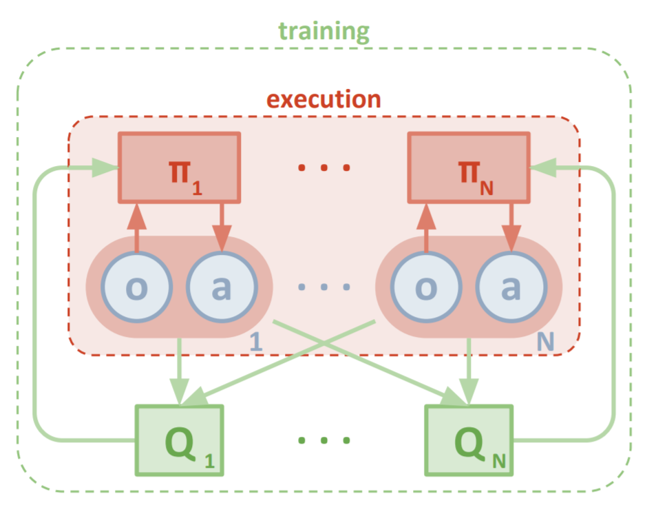
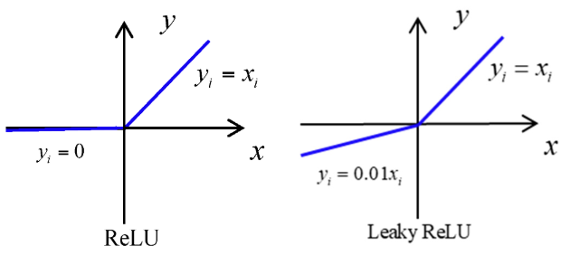
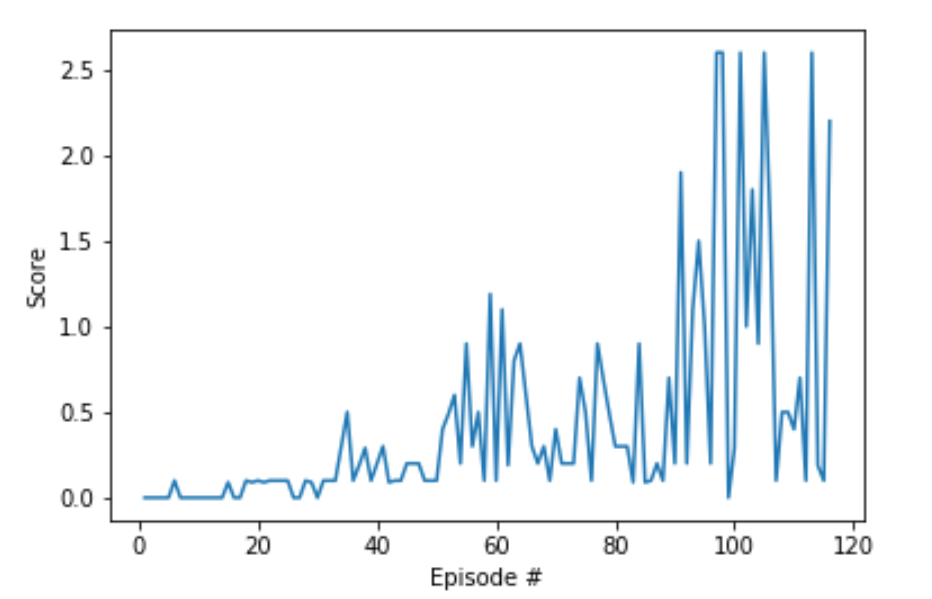

# Project 2: Continuous Control


## Goal
In this environment, two agents control rackets to bounce a ball over a net.
If an agent hits the ball over the net, it receives a reward of +0.1.
If an agent lets a ball hit the ground or hits the ball out of bounds,
it receives a reward of -0.01. Thus, the goal of each agent is to keep the ball in play.

## Summary of Environment
```python
IINFO:unityagents:
'Academy' started successfully!
Unity Academy name: Academy
        Number of Brains: 1
        Number of External Brains : 1
        Lesson number : 0
        Reset Parameters :

Unity brain name: TennisBrain
        Number of Visual Observations (per agent): 0
        Vector Observation space type: continuous
        Vector Observation space size (per agent): 8
        Number of stacked Vector Observation: 3
        Vector Action space type: continuous
        Vector Action space size (per agent): 2
        Vector Action descriptions: ,

Number of agents: 2
Size of each action: 2
There are 2 agents. Each observes a state with length: 24
The state for the first agent looks like: [ 0.          0.          0.          0.          0.          0.
  0.          0.          0.          0.          0.          0.
  0.          0.          0.          0.         -6.65278625 -1.5
 -0.          0.          6.83172083  6.         -0.          0.        ]

```
The observation space consists of 8 variables corresponding to the position and velocity
of the ball and racket. Each agent receives its own, local observation.
Two continuous actions are available, corresponding to movement toward (or away from)
the net, and jumping.


# Random Agent as a Benchmark
```python
efor i in range(1, 6):                                      # play game for 5 episodes
    env_info = env.reset(train_mode=False)[brain_name]     # reset the environment
    states = env_info.vector_observations                  # get the current state (for each agent)
    scores = np.zeros(num_agents)                          # initialize the score (for each agent)
    while True:
        actions = np.random.randn(num_agents, action_size) # select an action (for each agent)
        actions = np.clip(actions, -1, 1)                  # all actions between -1 and 1
        env_info = env.step(actions)[brain_name]           # send all actions to tne environment
        next_states = env_info.vector_observations         # get next state (for each agent)
        rewards = env_info.rewards                         # get reward (for each agent)
        dones = env_info.local_done                        # see if episode finished
        scores += env_info.rewards                         # update the score (for each agent)
        states = next_states                               # roll over states to next time step
        if np.any(dones):                                  # exit loop if episode finished
            break
    print('Score (max over agents) from episode {}: {}'.format(i, np.max(scores)))
    >> Score (max over agents) from episode 1: 0.0
    >> Score (max over agents) from episode 2: 0.0
    >> Score (max over agents) from episode 3: 0.0
    >> Score (max over agents) from episode 4: 0.10000000149011612
    >> Score (max over agents) from episode 5: 0.0
```
The score is usually close to 0 for random agents.


## Algorithm Description of MADDPG
Udacity's DDPG [code](https://github.com/udacity/deep-reinforcement-learning/blob/master/ddpg-pendulum/ddpg_agent.py), also utilised in Project 2, with additional tweaks, has been used as the basis for this project .

In the paper ([Multi-Agent Actor-Critic for Mixed
Cooperative-Competitive Environments](https://papers.nips.cc/paper/7217-multi-agent-actor-critic-for-mixed-cooperative-competitive-environments.pdf)),
the authors introduce the idea of Multi Agent Deep Deterministic Policy Gradient (MADDPG)
algorithm - a centralised critic and decentralised actor framework.


- During training, a centralised critic module (shared replay buffer) provides agents with
information about the observation and hence the  potential action all agents. This ensure that
the training environment remains stationary, even if the policies of other agents change.
P(s'<sub>0</sub> | s, a <sub>1</sub>, ..., a<sub>N</sub> , π<sub>1</sub>, ..., π<sub>N</sub> ) =
(s<sub>0</sub> | s, a <sub>1</sub>, ..., a<sub>N</sub> ) =
(s'<sub>0</sub> | s, a <sub>1</sub>, ..., a<sub>N</sub> , π'<sub>1</sub>, ..., π'<sub>N</sub> ) =
for any π<sub>i</sub> ≠ π<sub>j</sub>.

- During testing , the agent does not have access to all the  information,
and does not know the policy of the other agents.
It will only utilise the information from its own critic module to take action.

In contrast to Q-learning, the agent will have access to the Q-function containing the same
information during training and testing periods.




#### Hyperparameters of MADDPG agent
```python
BLEARN_EVERY = 1         # learning timestep interval
LEARN_NUM = 5           # number of learning passes
BUFFER_SIZE = int(1e6)  # replay buffer size
BATCH_SIZE = 128        # minibatch size
SEED = 0
batch_size=128          # minibatch size
gamma=0.99              # discount factor
tau=0.1                 # for soft update of target parameters
lr_actor=5e-4           # learning rate of the actor
lr_critic=1e-3,         # learning rate of the critic
weight_decay=0.00000001,# L2 weight decay
RANDOM_SEED=0
```
The hyperparameters in the neural network architecture (model.py), agent (ddpg_agent) and training (Continuous_Control-v20.ipynb) have not been optimised due to the lack of time and resources.

#### MADDPG agent code
```python
class Agent():
    """Interacts with and learns from the environment."""

    def __init__(
        self,
        state_size=None,        # state space size
        action_size=None,       # action size
        memory=None,
        buffer_size=BUFFER_SIZE,# replay buffer size
        batch_size=BATCH_SIZE,  # minibatch size
        gamma=0.99,             # discount factor
        tau=5e-3,               # for soft update of target parameters
        lr_actor=1e-3,          # learning rate of the actor
        lr_critic=1e-3,         # learning rate of the critic
        weight_decay=0.00000001,# L2 weight decay
        random_seed=0
    ):
        self.state_size = state_size
        self.action_size = action_size
        self.buffer_size = buffer_size       # replay buffer size
        self.batch_size = batch_size         # minibatch size
        self.gamma = gamma                   # discount factor
        self.tau = tau                       # for soft update of target parameters
        self.lr_actor = lr_actor             # learning rate of the actor
        self.lr_critic = lr_critic           # learning rate of the critic
        self.weight_decay = weight_decay     # L2 weight decay
        self.seed = random.seed(random_seed)

        self.timestep = 0

        # Actor Network (w/ Target Network)
        self.actor_local = Actor(state_size, action_size, random_seed).to(device)
        self.actor_target = Actor(state_size, action_size, random_seed).to(device)
        self.actor_optimizer = optim.Adam(self.actor_local.parameters(), lr=lr_actor)

        # Critic Network (w/ Target Network)
        self.critic_local = Critic(state_size, action_size, random_seed).to(device)
        self.critic_target = Critic(state_size, action_size, random_seed).to(device)
        self.critic_optimizer = optim.Adam(self.critic_local.parameters(), lr=lr_critic, weight_decay=self.weight_decay)

        # Noise process
        self.noise = OUNoise(action_size, random_seed)

        # Replay memory
        if not isinstance(memory, ReplayBuffer):
            memory = ReplayBuffer(buffer_size, batch_size, random_seed, device)
        self.memory = memory

    def step(self, state, action, reward, next_state, done):
        """Save experience in replay memory, and use random sample from buffer to learn."""
        self.timestep += 1
        # Save experience / reward
        self.memory.add(state, action, reward, next_state, done)
        # Learn, if enough samples are available in memory and at learning interval settings
        if len(self.memory) > self.batch_size and self.timestep % LEARN_EVERY == 0:
                for _ in range(LEARN_NUM):
                    experiences = self.memory.sample()
                    self.learn(experiences, self.gamma)


    def act(self, state, add_noise=True):
        """Returns actions for given state as per current policy."""
        state = torch.from_numpy(state).float().to(device)
        self.actor_local.eval()
        with torch.no_grad():
            action = self.actor_local(state).cpu().data.numpy()
        self.actor_local.train()
        if add_noise:
            action += self.noise.sample()
        return np.clip(action, -1, 1)

    def reset(self):
        self.noise.reset()

    def learn(self, experiences, gamma):
        """Update policy and value parameters using given batch of experience tuples.
        Q_targets = r + γ * critic_target(next_state, actor_target(next_state))
        where:
            actor_target(state) -> action
            critic_target(state, action) -> Q-value
        Params
        ======
            experiences (Tuple[torch.Tensor]): tuple of (s, a, r, s', done) tuples
            gamma (float): discount factor
        """
        states, actions, rewards, next_states, dones = experiences

        # ---------------------------- update critic ---------------------------- #
        # Get predicted next-state actions and Q values from target models
        actions_next = self.actor_target(next_states)
        Q_targets_next = self.critic_target(next_states, actions_next)
        # Compute Q targets for current states (y_i)
        Q_targets = rewards + (gamma * Q_targets_next * (1 - dones))
        # Compute critic loss
        Q_expected = self.critic_local(states, actions)
        critic_loss = F.mse_loss(Q_expected, Q_targets)
        # Minimize the loss
        self.critic_optimizer.zero_grad()
        critic_loss.backward()
        torch.nn.utils.clip_grad_norm_(self.critic_local.parameters(), 1)
        self.critic_optimizer.step()

        # ---------------------------- update actor ---------------------------- #
        # Compute actor loss
        actions_pred = self.actor_local(states)
        actor_loss = -self.critic_local(states, actions_pred).mean()
        # Minimize the loss
        self.actor_optimizer.zero_grad()
        actor_loss.backward()
        self.actor_optimizer.step()

        # ----------------------- update target networks ----------------------- #
        self.soft_update(self.critic_local, self.critic_target, self.tau)
        self.soft_update(self.actor_local, self.actor_target, self.tau)

    def soft_update(self, local_model, target_model, tau):
        """Soft update model parameters.
        θ_target = τ*θ_local + (1 - τ)*θ_target
        Params
        ======
            local_model: PyTorch model (weights will be copied from)
            target_model: PyTorch model (weights will be copied to)
            tau (float): interpolation parameter
        """
        for target_param, local_param in zip(target_model.parameters(), local_model.parameters()):
            target_param.data.copy_(tau*local_param.data + (1.0-tau)*target_param.data)

```
### Multiple Learning Passes per Episode

Performing multiple learning passes per episode seems to provide faster convergence
and higher scores despite the trade-off of slower training.
At every training step, the agent will sample experiences from the buffer
and execute the learn method 5 times.
``` python
LEARN_EVERY = 1         # learning interval (no. of episodes)
LEARN_NUM = 5           # number of passes per learning step
```

### Gradient Clipping
This is a useful method to prevent the problem of exploding gradients.
There may be a situation where the training causes the network weights to become too large quickly,
inhibiting the learning process.

```python
torch.nn.utils.clip_grad_norm_(self.critic_local.parameters(), 1)
```
 he function clips the norm of the gradients at 1,limiting the size of the parameter updates.
Note tha the norm is computed over all gradients together,
as if they were concatenated into a single vector.
#### Soft Updates
The target network weights are gradually updated by blending the local network weights with proportion tau (0.1%).
This ensures that the weights of the network only changes slightly during each updates, aiding the stability of learning.


#### Ornstein-Uhlenbeck Noise
The Ornstein-Uhlenbeck noise (random noise) is added to the state of the network to aid exploration and enhance the robustness of the RL agent.


#### Replay buffer
For this project, the 2 agents use the same replay buffer to share their experiences.
This would allow both agent's critic to utilise all the information gathered by both agents during training.
However, during testing, the agent can only rely on the information from its critic.

```python
Shared_Memory = ReplayBuffer(buffer_size=BUFFER_SIZE, batch_size=BATCH_SIZE)
```

#### Actor Critic Architecture
Only slight changes have been made to the Actor Critic architecture,
namely the batch normalisation layers and the use of leaky Relus.
```python
def hidden_init(layer):
    fan_in = layer.weight.data.size()[0]
    lim = 1. / np.sqrt(fan_in)
    return (-lim, lim)

class Actor(nn.Module):
    """Actor (Policy) Model."""

    def __init__(self, state_size, action_size, seed, fc1_units=512, fc2_units=256):
        """Initialize parameters and build model.
        Params
        ======
            state_size (int): Dimension of each state
            action_size (int): Dimension of each action
            seed (int): Random seed
            fc1_units (int): Number of nodes in first hidden layer
            fc2_units (int): Number of nodes in second hidden layer
        """
        super(Actor, self).__init__()
        self.seed = torch.manual_seed(seed)
        self.fc1 = nn.Linear(state_size, fc1_units)
        self.fc2 = nn.Linear(fc1_units, fc2_units)
        self.fc3 = nn.Linear(fc2_units, action_size)

        # Normalization layers
        self.bn1 = nn.BatchNorm1d(fc1_units)
        self.bn2 = nn.BatchNorm1d(fc2_units)
        self.reset_parameters()

    def reset_parameters(self):
        self.fc1.weight.data.uniform_(*hidden_init(self.fc1))
        self.fc2.weight.data.uniform_(*hidden_init(self.fc2))
        self.fc3.weight.data.uniform_(-3e-3, 3e-3)

    def forward(self, state):
        """Build an actor (policy) network that maps states -> actions."""
        # Reshape the state to comply with Batch Normalization
        if state.dim() == 1:
            state = torch.unsqueeze(state,0)

        x = F.leaky_relu(self.fc1(state))
        x = self.bn1(x)
        x = F.leaky_relu(self.fc2(x))
        x = self.bn2(x)
        return torch.tanh(self.fc3(x))

class Critic(nn.Module):
    """Critic (Value) Model."""

    def __init__(self, state_size, action_size, seed, fcs1_units=512, fc2_units=256):
        """Initialize parameters and build model.
        Params
        ======
            state_size (int): Dimension of each state
            action_size (int): Dimension of each action
            seed (int): Random seed
            fcs1_units (int): Number of nodes in the first hidden layer
            fc2_units (int): Number of nodes in the second hidden layer
        """
        super(Critic, self).__init__()
        self.seed = torch.manual_seed(seed)
        self.fcs1 = nn.Linear(state_size, fcs1_units)
        self.fc2 = nn.Linear(fcs1_units+action_size, fc2_units)
        self.fc3 = nn.Linear(fc2_units, 1)

        # Normalization layer
        self.bn1 = nn.BatchNorm1d(fcs1_units)
        #self.bn2 = nn.BatchNorm1d(fc2_units)
        self.reset_parameters()

    def reset_parameters(self):
        self.fcs1.weight.data.uniform_(*hidden_init(self.fcs1))
        self.fc2.weight.data.uniform_(*hidden_init(self.fc2))
        self.fc3.weight.data.uniform_(-3e-3, 3e-3)

    def forward(self, state, action):
        """Build a critic (value) network that maps (state, action) pairs -> Q-values."""
        # Reshape the state to comply with Batch Normalization
        if state.dim() == 1:
            state = torch.unsqueeze(state,0)

        xs = F.leaky_relu(self.fcs1(state))
        xs = self.bn1(xs)
        x = torch.cat((xs, action), dim=1)
        x = F.leaky_relu(self.fc2(x))
        #x = self.bn2(x)
        return self.fc3(x)

```
#### Batch normalisation
Batch normalisation is again used for this project.
This time 2 batchnorm layers  are applied to the first 2 layers of the Actor agent
while only 1 batchnorm layer is applied to the first layer of the Critic Agent.
In my case, 2 batchnorm layers in the Critic Agent seem to slow down training.

#### Leaky Relu



The Leaky Relu, which a small gradient in the negative range,
is considered to be an improvement over the Relu.
It solves the problem of the 'dying relu',
where the values of the Relu is zero for all negative input values,
allowing for higher learning rates.
The dying problem usually occurs when the learning rate is too high.


A ReLU neuron is “dead” if it’s stuck in the negative side and remains at 0.
Since the Relu gradient in the negative range is also 0, it is unlikely for it to recover.
Over the time, a large part of the network may stop learning as result.

## Results

The MADDPG agent successfully solved the environment after 116 episodes in 1 hour and 30 minutes.



## Testing the Agent
```
for i in range(1, 6):                                      # play game for 5 episodes
    env_info = env.reset(train_mode=False)[brain_name]     # reset the environment
    states = env_info.vector_observations                  # get the current state (for each agent)
    scores = np.zeros(num_agents)                          # initialize the score (for each agent)
    while True:
        actions = [agent.act(states[i], add_noise=False) for i,agent in enumerate(Agents)]
        env_info = env.step(actions)[brain_name]           # send all actions to tne environment
        next_states = env_info.vector_observations         # get next state (for each agent)
        rewards = env_info.rewards                         # get reward (for each agent)
        dones = env_info.local_done                        # see if episode finished
        scores += env_info.rewards                         # update the score (for each agent)
        states = next_states                               # roll over states to next time step
        if np.any(dones):                                  # exit loop if episode finished
            break
    print('Score (max over agents) from episode {}: {}'.format(i, np.max(scores)))
    >> Score (max over agents) from episode 1: 2.600000038743019
    >> Score (max over agents) from episode 2: 2.7000000402331352
    >> Score (max over agents) from episode 3: 2.600000038743019
    >>Score (max over agents) from episode 4: 2.600000038743019
    >> Score (max over agents) from episode 5: 2.7000000402331352
```
The agent consistently manages to obtain scores around 2.6.

### Ideas for future work

1. Additional improvements to this implementation of MADDPG maybe the introduction of Prioritised Experience Replay for more robust and stable learning.
2. PPO could be another RL algorithm to implement as an alternative  for this task.
3. Another avenue would be to modify the structure of the MADDPG agent by training it with only one shared critic network.
